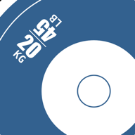

<div align="center">
  

# CrossConvert

**Fast functional fitness conversions, wherever you train.**

[](LICENSE)
[](https://react.dev/)
[](https://www.typescriptlang.org/)
[](https://web.dev/explore/progressive-web-apps)

A mobile-first progressive web app for converting workout movements, distances, weights, and barbell percentages.

</div>

## Features

- **Workout equivalents** — convert calories, meters, miles, and reps across rowing, skiing, biking, running, burpees, and double-unders.
- **Weight and distance conversion** — switch between kilograms and pounds or metric and imperial distances.
- **Barbell loading** — choose a bar and available plates to see a practical loading breakdown.
- **Percentage calculator** — build and save a custom percentage table for any working weight.
- **Local and private** — settings stay in the browser; no account or backend is required.
- **Installable and offline** — use CrossConvert as a PWA after the first successful load.

> [!NOTE]
> Workout equivalents are estimates based on fixed reference values. Use them as a practical starting point, not as individualized training advice.

## Getting started

### Prerequisites

- [Node.js](https://nodejs.org/) 22.12 or newer
- npm

### Run locally

```sh
git clone https://github.com/hstaudacher/crossconvert.git
cd crossconvert
npm ci
npm run dev
```

Vite prints the local development URL when the server starts.

## Commands

| Command              | Purpose                                   |
| -------------------- | ----------------------------------------- |
| `npm run dev`        | Start the development server              |
| `npm run build`      | Type-check and create a production build  |
| `npm run preview`    | Preview the production build locally      |
| `npm test`           | Run the test suite once                   |
| `npm run test:watch` | Run tests in watch mode                   |
| `npm run lint`       | Check the code with ESLint                |
| `npm run format`     | Check formatting with Prettier            |
| `npm run font`       | Regenerate the icon font from SVG sources |

## How the PWA works

The production build generates a web app manifest and service worker with
[`vite-plugin-pwa`](https://vite-pwa-org.netlify.app/). Static assets are cached for offline use, and updates are applied automatically. Equipment and percentage preferences are persisted in `localStorage`.

To test installation and offline behavior, use a production build:

```sh
npm run build
npm run preview
```

Service workers require a secure context in production, so deploy the app over HTTPS.

## Tech stack

- React
- TypeScript
- Vite
- Vitest and Testing Library
- vite-plugin-pwa

## Contributing

Bug reports and pull requests are welcome. Before submitting a change, run:

```sh
npm test
npm run lint
npm run format
npm run build
```

## License

CrossConvert is available under the [MIT License](LICENSE).

CrossFit is a registered trademark of CrossFit, LLC. CrossConvert is an independent project and is not affiliated with or endorsed by CrossFit, LLC.
